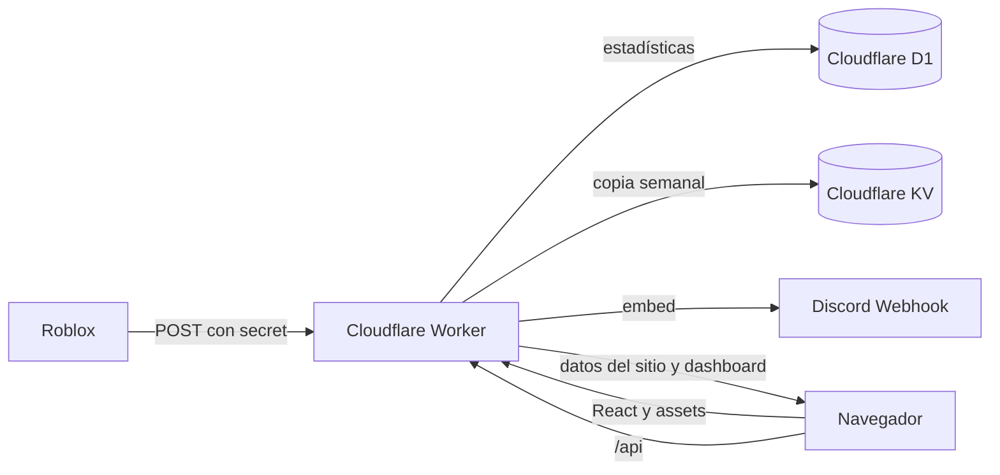
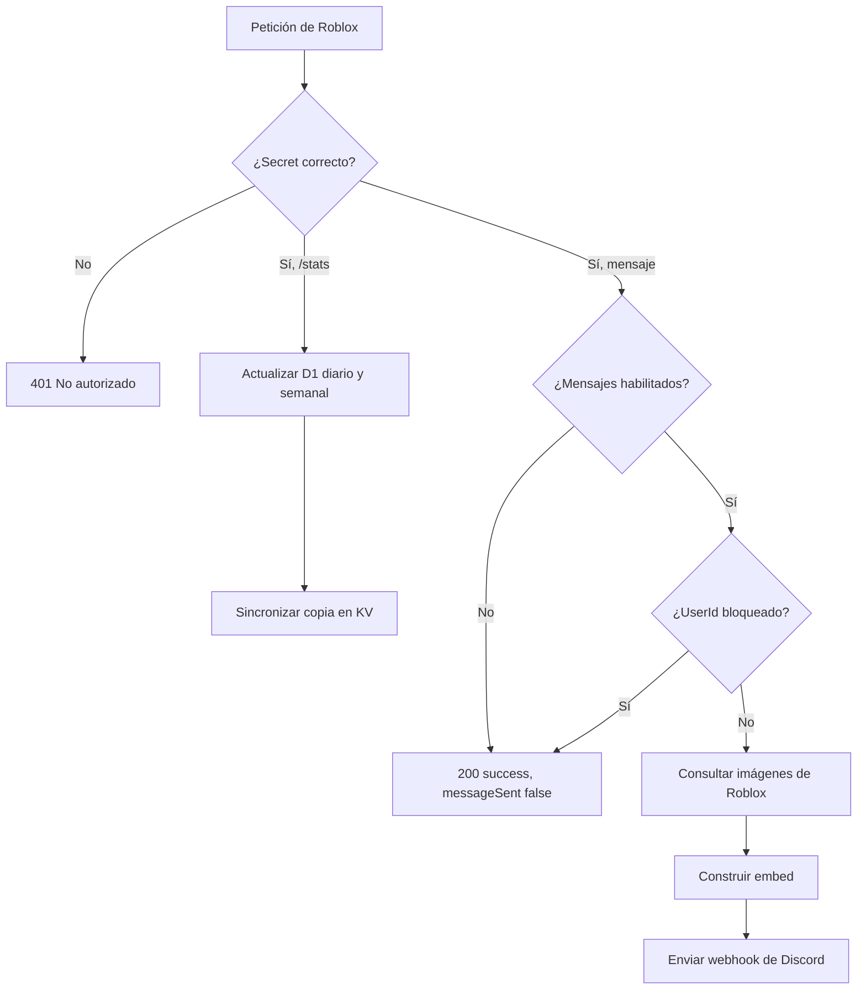

# WEB ANOTHER GAME MORE

Para llevar un control de todo pues

> [!NOTE]
> Ultima actualizacion [ 20/07/2026 ] | ( 25.3~horas de trabajo )

> [!CAUTION]
> Cuidado pequeño niño, cuando hice este codigo solo dios y yo sabiamos como funcionaba. Ahora ¡SOLO DIOS SABE!

> [!WARNING]
> Actualiza solo si sabes lo que estas haciendo. Esto esta conectado a Cloudflare con un sistema de Webhooks - Discord con una base de datos.

> [!IMPORTANT]
> Los servidores estan activos 24/7, si un error aparece, arreglalo lo mas rapido posible

> [!TIP]
> Para agregar mas variables encriptadas ve a Cloudflare y añadele en Workers & Pages -> Settigns -> Variables and secrets :D

## Índice

- [Qué contiene el proyecto](#qué-contiene-el-proyecto)
- [Cómo funciona todo](#cómo-funciona-todo)
- [Estructura de archivos](#estructura-de-archivos)
- [Cómo fue creada la página](#cómo-fue-creada-la-página)
- [Preparar el entorno local](#preparar-el-entorno-local)
- [Cloudflare, D1, KV y secretos](#cloudflare-d1-kv-y-secretos)
- [Rutas de la API](#rutas-de-la-api)
- [Referencia de funciones del Worker](#referencia-de-funciones-del-worker)
- [Referencia de funciones del frontend](#referencia-de-funciones-del-frontend)
- [Base de datos y migraciones](#base-de-datos-y-migraciones)
- [Cómo modificar la web](#cómo-modificar-la-web)
- [Pruebas y despliegue](#pruebas-y-despliegue)
- [Problemas comunes](#problemas-comunes)

## Qué contiene el proyecto

Este repositorio contiene la web pública y el panel administrativo de Another Game More, además del Worker que recibe información desde Roblox, guarda estadísticas y envía mensajes embed a Discord.

Las piezas principales son:

- **Frontend:** React 19, React Router y Vite.
- **Estilos:** CSS propio en `frontend/src/index.css`; no utiliza una librería visual externa.
- **Backend:** Cloudflare Worker en JavaScript.
- **Base de datos:** Cloudflare D1.
- **Compatibilidad histórica:** Cloudflare KV conserva una copia de las estadísticas semanales.
- **Archivos públicos:** Cloudflare Workers Static Assets sirve el build de React.
- **Autenticación:** correo y contraseña, Google OAuth y Discord OAuth.
- **Integraciones:** Roblox Thumbnails, Roblox Users y webhooks de Discord.
- **Tareas programadas:** un cron envía el resumen de la semana anterior cada lunes a las 06:00 UTC.

## Cómo funciona todo

### Flujo general



### Flujo de una compra o donación

Roblox realiza dos operaciones independientes:

1. Envía los datos estadísticos a `POST /stats`.
2. Envía la información visual a `POST /`, `POST /item` o `POST /bulk` para crear el mensaje de Discord.

Esta separación es importante. El control del Worker y la lista de UserIds bloqueados solo impiden el segundo paso. `POST /stats` se procesa antes de revisar esas restricciones, por lo que las estadísticas continúan sumándose aunque no se envíe ningún mensaje.



### Flujo de acceso

- El registro manual guarda un hash PBKDF2-SHA256 en D1 y crea la cuenta con rol `member`.
- Google y Discord entregan un correo verificado; el Worker enlaza la identidad OAuth con un usuario de D1.
- La sesión se guarda en una cookie `HttpOnly`, `Secure` y `SameSite=Lax`, firmada con HMAC-SHA256.
- Los miembros pueden ver la página pública.
- Los administradores pueden entrar al dashboard.
- Solo el correo configurado en `OWNER_EMAIL` puede utilizar **Promote**.

## Estructura de archivos

```text
.
├── frontend/
│   ├── index.html                 # Documento HTML base de Vite
│   ├── vite.config.js             # React y proxy local hacia el Worker
│   └── src/
│       ├── assets/                # Logotipo e iconos rasterizados
│       ├── components/            # Componentes comunes, landing y dashboard
│       ├── contexts/              # Estado global de autenticación
│       ├── hooks/                 # Hook useAuth
│       ├── layouts/               # Estructura pública y administrativa
│       ├── pages/                 # Páginas asociadas a las rutas
│       ├── router/                # Mapa de rutas de React
│       ├── services/              # Cliente de API y autenticación
│       ├── utils/                 # Scroll centrado y accesible
│       ├── App.jsx                # Une autenticación y router
│       ├── main.jsx               # Punto de entrada de React
│       └── index.css              # Todos los estilos y animaciones
├── worker/
│   ├── database/
│   │   ├── database.js            # Consultas y escrituras de D1
│   │   └── migrations/            # Historial del esquema SQL
│   ├── routes/                    # Rutas públicas, auth y administración
│   ├── services/                  # Stats, OAuth, Discord, Roblox y seguridad
│   ├── tests/                     # Pruebas automáticas del Worker
│   ├── utils/                     # Criptografía y respuestas HTTP
│   ├── config.js                  # Correo del propietario
│   └── index.js                   # Entrada principal del Worker y cron
├── .dev.vars.example              # Plantilla de secretos locales
├── package.json                   # Scripts generales
└── wrangler.toml                  # Configuración de Cloudflare
```

`worker/scripts/migrate.js` y `003_seed_admin_user.sql` están vacíos y se conservan únicamente como archivos históricos. Las migraciones reales se ejecutan con Wrangler.

## Cómo fue creada la página

### 1. Documento inicial

`frontend/index.html` define el idioma, favicon, metadatos y el elemento `<div id="root">`. Vite usa ese elemento para montar React.

### 2. Montaje de React

`frontend/src/main.jsx` crea la raíz de React, activa `StrictMode`, carga `index.css` y renderiza `App`.

`App` coloca toda la aplicación dentro de `AuthProvider` y después carga `AppRouter`. Así, cualquier página puede consultar la sesión con `useAuth()`.

### 3. Enrutamiento

React Router controla estas vistas:

| URL | Componente | Acceso |
| --- | --- | --- |
| `/` | `Home` | Público |
| `/login` | `Login` | Público |
| `/signup` | `Signup` | Público |
| `/dashboard` | `Dashboard` | Admin |
| `/dashboard/stats` | `Stats` | Admin |
| `/dashboard/worker` | `WorkerControl` | Admin |
| `/dashboard/database` | `Database` | Admin |
| `/dashboard/promote` | `Promote` | Solo propietario |
| Cualquier otra | `NotFound` | Público |

### 4. Contenido público

`Home` solicita `GET /api/site`. D1 entrega los textos del estudio y las tarjetas de contacto. Si la API no está disponible, React utiliza valores de respaldo incluidos en `Home.jsx` y `ContactGrid.jsx`.

Las secciones aparecen mediante `IntersectionObserver`. La barra de navegación utiliza otro observer para detectar la sección visible y `scrollToSection` calcula una posición centrada debajo del encabezado.

### 5. Dashboard

`DashboardLayout` valida la sesión antes de mostrar el panel. El contenido se divide en:

- **Resumen:** gráficas semanales, mensuales y globales.
- **Stats:** selección y edición exacta de una semana.
- **Control Worker:** pausa de mensajes y bloqueo individual por UserId.
- **DataBase:** conteos generales de D1.
- **Promote:** búsqueda y promoción de usuarios, solo para el propietario.

### 6. Build y entrega de archivos

Vite transforma JSX, CSS e imágenes y genera `frontend/dist`. La sección `[assets]` de `wrangler.toml` enlaza esa carpeta al binding `ASSETS`. El Worker atiende primero las rutas `/api`; para cualquier `GET` restante entrega React y utiliza el modo SPA para que las rutas del dashboard funcionen al recargar.

## Preparar el entorno local

### Requisitos

- Node.js 22 o compatible.
- npm.
- Una cuenta de Cloudflare para trabajar con los recursos remotos.
- Wrangler autenticado mediante `npx wrangler login` cuando sea necesario.

### Instalar dependencias

Desde la raíz del repositorio:

```bash
npm ci
```

El `postinstall` ejecuta el build. El script raíz también instala las dependencias exactas del frontend mediante su propio `package-lock.json`.

### Configurar secretos locales

Copia `.dev.vars.example` como `.dev.vars` y completa únicamente el archivo local. `.dev.vars` está ignorado por Git.

```bash
cp .dev.vars.example .dev.vars
```

Para probar toda la integración, el archivo puede contener estas claves:

```dotenv
SESSION_SECRET=
PASSWORD_PEPPER=
DONATION_SECRET=
ITEMS_SECRET=
STATS_SECRET=
DONATION_WEBHOOK=
SINGLE_ITEM_WEBHOOK=
BULK_ITEMS_WEBHOOK=
STATS_WEBHOOK=
GOOGLE_CLIENT_ID=
GOOGLE_CLIENT_SECRET=
DISCORD_CLIENT_ID=
DISCORD_CLIENT_SECRET=
```

Nunca subas `.dev.vars`, contraseñas, client secrets ni URLs completas de webhooks al repositorio.

### Crear la base local

```bash
npx wrangler d1 migrations apply another-game-more --local
```

### Ejecutar con recarga automática

Abre dos terminales desde la raíz.

Terminal 1, API y recursos de Cloudflare:

```bash
npx wrangler dev
```

Terminal 2, interfaz de Vite:

```bash
npm run dev --prefix frontend
```

Vite abre normalmente `http://127.0.0.1:5173` y redirige `/api` a `http://127.0.0.1:8787`. Para cambiar el destino se puede definir `VITE_API_PROXY`.

Si solo quieres comprobar el build completo servido por Cloudflare:

```bash
npm run build
npx wrangler dev
```

## Cloudflare, D1, KV y secretos

### Bindings configurados

| Binding | Tipo | Uso |
| --- | --- | --- |
| `ASSETS` | Static Assets | Sirve `frontend/dist` y el fallback SPA. |
| `DB` | D1 | Usuarios, OAuth, contactos, configuración y estadísticas. |
| `WEEKLY_STATS` | KV | Copia compatible del historial semanal antiguo. |

El nombre del Worker es `prchsalerts`. El cron configurado es `0 6 * * 1`, es decir, lunes a las 06:00 UTC.

### Secretos y variables

| Nombre | Obligatorio para | Descripción |
| --- | --- | --- |
| `SESSION_SECRET` | Sesiones y OAuth | Firma cookies y estados OAuth. Debe ser largo y aleatorio. |
| `PASSWORD_PEPPER` | Acceso por correo | Se añade a la contraseña antes de derivar su hash. |
| `DONATION_SECRET` | Roblox → `/` | Autoriza mensajes de donaciones. |
| `ITEMS_SECRET` | Roblox → `/item`, `/bulk` | Autoriza mensajes de compras. |
| `STATS_SECRET` | Roblox → `/stats` | Autoriza actualizaciones estadísticas. |
| `DONATION_WEBHOOK` | Discord | Webhook de donaciones. |
| `SINGLE_ITEM_WEBHOOK` | Discord | Webhook de compras individuales. |
| `BULK_ITEMS_WEBHOOK` | Discord | Webhook de compras bulk. |
| `STATS_WEBHOOK` | Cron | Webhook del resumen semanal. |
| `GOOGLE_CLIENT_ID` | Google OAuth | Identificador público de la aplicación. |
| `GOOGLE_CLIENT_SECRET` | Google OAuth | Secreto de la aplicación. |
| `DISCORD_CLIENT_ID` | Discord OAuth | Identificador público de la aplicación. |
| `DISCORD_CLIENT_SECRET` | Discord OAuth | Secreto de la aplicación. |
| `ACCOUNT_CONFIG` | Compatibilidad opcional | Lista JSON de cuentas antiguas; D1 es el sistema principal. |

Para crear o reemplazar un secreto en producción:

```bash
npx wrangler secret put NOMBRE_DEL_SECRETO
```

Wrangler pedirá el valor sin guardarlo en el código. Repite el comando por cada secreto.

### OAuth

Las URLs de redirección de producción son:

- Google: `https://prchsalerts.kikinttrex0231.workers.dev/api/auth/oauth/google/callback`
- Discord: `https://prchsalerts.kikinttrex0231.workers.dev/api/auth/oauth/discord/callback`

Los botones solo se habilitan cuando están presentes tanto el Client ID como el Client Secret del proveedor.

### Configuración del build en Cloudflare

En **Workers & Pages → prchsalerts → Settings → Builds**:

- Root directory: `/`
- Build command: `npm run build`
- Deploy command: `npx wrangler deploy --keep-vars`

No configures `frontend` como raíz y no publiques `frontend` directamente. Eso crea un Worker de archivos estáticos sin el código de `worker/index.js`, desactiva variables, bindings y rutas de API, y puede dejar la página en blanco.

## Rutas de la API

### Públicas y Roblox

| Método | Ruta | Secret | Función |
| --- | --- | --- | --- |
| `GET` | `/api/site` | Ninguno | Devuelve textos y contactos visibles. |
| `GET` | `/api/status` | Ninguno | Informa si los mensajes están activos o pausados. |
| `POST` | `/` | `DONATION_SECRET` | Construye y envía el embed de una donación. |
| `POST` | `/item` | `ITEMS_SECRET` | Construye y envía el embed de una compra individual. |
| `POST` | `/bulk` | `ITEMS_SECRET` | Construye y envía el embed de una compra bulk. |
| `POST` | `/stats` | `STATS_SECRET` | Suma estadísticas diarias y semanales. |

Ejemplo mínimo para estadísticas de donación:

```json
{
  "secret": "VALOR_CONFIGURADO",
  "type": "Donation",
  "amount": 100,
  "userId": 123456
}
```

Ejemplo mínimo para estadísticas de compra individual:

```json
{
  "secret": "VALOR_CONFIGURADO",
  "type": "Single",
  "price": 50,
  "creatorId": 802409113,
  "isPlusPlayer": false,
  "userId": 123456
}
```

Ejemplo mínimo para estadísticas bulk:

```json
{
  "secret": "VALOR_CONFIGURADO",
  "type": "Bulk",
  "items": [
    { "price": 50, "creatorId": 802409113 },
    { "price": 20, "creatorId": 1 }
  ],
  "isPlusPlayer": false,
  "userId": 123456
}
```

### Autenticación

| Método | Ruta | Función |
| --- | --- | --- |
| `GET` | `/api/auth/session` | Devuelve el usuario actual o una sesión vacía. |
| `GET` | `/api/auth/providers` | Indica si Google y Discord están configurados. |
| `POST` | `/api/auth/signup` | Crea una cuenta por correo. |
| `POST` | `/api/auth/login` | Inicia una sesión por correo. |
| `POST` | `/api/auth/logout` | Elimina la cookie de sesión. |
| `GET` | `/api/auth/oauth/google` | Inicia OAuth con Google. |
| `GET` | `/api/auth/oauth/google/callback` | Completa OAuth con Google. |
| `GET` | `/api/auth/oauth/discord` | Inicia OAuth con Discord. |
| `GET` | `/api/auth/oauth/discord/callback` | Completa OAuth con Discord. |

### Administración

Todas las rutas requieren una sesión con rol `admin`. Las rutas de Promote requieren además ser el propietario.

| Método | Ruta | Función |
| --- | --- | --- |
| `GET` | `/api/admin/analytics` | Crea resúmenes semanal, mensual y global. |
| `GET` | `/api/admin/stats?week=AAAA-WN` | Devuelve una semana y todas las Keys disponibles. |
| `PUT` | `/api/admin/stats/AAAA-WN` | Reemplaza los cinco valores de una semana. |
| `GET` | `/api/admin/worker` | Lee el estado de los mensajes. |
| `PUT` | `/api/admin/worker` | Habilita o pausa mensajes. |
| `GET` | `/api/admin/worker/blocked-users` | Lista UserIds excluidos. |
| `POST` | `/api/admin/worker/blocked-users` | Agrega un UserId. |
| `DELETE` | `/api/admin/worker/blocked-users/:userId` | Elimina un UserId. |
| `GET` | `/api/admin/worker/blocked-users/:userId/profile` | Consulta el perfil en Roblox. |
| `GET` | `/api/admin/database` | Devuelve conteos y el registro de la semana actual. |
| `GET` | `/api/admin/promote/users?query=...` | Busca usuarios; solo propietario. |
| `PUT` | `/api/admin/promote/users/:id` | Promueve a admin; solo propietario. |

## Referencia de funciones del Worker

La siguiente referencia cubre todas las funciones con nombre, métodos de entrada y componentes de servicio del Worker. Las callbacks anónimas pequeñas se describen dentro de la función que las contiene.

### `worker/index.js`

| Función | Qué hace |
| --- | --- |
| `fetch(request, env)` | Entrada de cada petición HTTP. Separa autenticación, administración, API pública, archivos React y webhooks. Convierte errores no controlados en un `500` JSON. |
| `scheduled(event, env)` | Entrada del cron. Si los mensajes están habilitados, busca la semana anterior, construye el resumen y lo envía a `STATS_WEBHOOK`. |

### `worker/routes/public.js`

| Función | Qué hace |
| --- | --- |
| `handlePublicWebhook(request, env, pathname)` | Valida método, ruta y secret. Procesa `/stats` sin depender del estado de Discord. Para mensajes revisa el interruptor y la blocklist, obtiene imágenes de Roblox, crea el embed correcto y lo envía. |

### `worker/routes/admin.js`

| Función | Qué hace |
| --- | --- |
| `handleAdmin(request, env, pathname)` | Protege y distribuye todas las rutas administrativas: analytics, Stats, estado del Worker, UserIds bloqueados, perfiles Roblox, resumen de D1 y Promote. También valida números y formatos de semana. |

### `worker/routes/auth.js`

| Función | Qué hace |
| --- | --- |
| `readCookie(request, name)` | Extrae una cookie concreta del encabezado HTTP. |
| `sessionCookie(value, maxAge)` | Construye la cookie segura `agm_session`. |
| `accounts(env)` | Lee cuentas antiguas desde `ACCOUNT_CONFIG`; devuelve una lista vacía si no existe o no es JSON válido. |
| `normalizedEmail(value)` | Limpia, convierte a minúsculas y valida un correo de hasta 254 caracteres. |
| `publicUser(user)` | Elimina datos sensibles y añade `isAdmin` e `isOwner` para el frontend. |
| `sessionToken(user, secret)` | Serializa id, correo, rol y expiración; después firma la carga con HMAC. |
| `sessionHeaders(user, env)` | Crea el encabezado `Set-Cookie` de una sesión nueva. |
| `getSession(request, env)` | Valida firma y expiración de la cookie; si tiene id, vuelve a consultar D1 para obtener el rol actual. |
| `requireAdmin(request, env)` | Devuelve la sesión únicamente si pertenece a un administrador. |
| `requireOwner(request, env)` | Devuelve la sesión únicamente si el correo coincide con `OWNER_EMAIL`. |
| `oauthErrorRedirect(request, error)` | Regresa al login con un código de error legible y borra el intento OAuth. |
| `oauthCallback(request, env, provider)` | Completa OAuth, crea la sesión y redirige al dashboard o al inicio según el rol. |
| `signup(request, env)` | Valida correo, confirmación y contraseña, crea un miembro en D1 e inicia su sesión. |
| `login(request, env)` | Busca la cuenta, verifica el hash y entrega una sesión segura. |
| `handleAuth(request, env, pathname)` | Distribuye todas las rutas `/api/auth/*`, incluidos inicio y callback de Google y Discord. |

### `worker/database/database.js`

| Función | Qué hace |
| --- | --- |
| `getUserByEmail(env, email)` | Busca un usuario por correo sin distinguir mayúsculas. |
| `getUserById(env, id)` | Busca un usuario por su id interno. |
| `createEmailUser(env, email, passwordHash)` | Inserta un miembro de correo y usa la parte anterior a `@` como nombre inicial. |
| `getUserByOAuth(env, provider, providerUserId)` | Busca un usuario mediante su identidad externa. |
| `getOrCreateOAuthUser(env, data)` | Reutiliza una identidad OAuth o crea el usuario y su enlace con el proveedor. |
| `listUsers(env, query)` | Busca hasta 100 usuarios y reúne sus proveedores de acceso. |
| `promoteUser(env, userId)` | Cambia el rol del usuario a `admin`. |
| `getWeeklyStats(env, weekKey)` | Lee una fila de `weekly_stats`. |
| `incrementWeeklyStats(env, weekKey, changes)` | Crea la semana o suma cambios mediante un UPSERT. |
| `replaceWeeklyStats(env, weekKey, values)` | Crea o reemplaza todos los valores exactos de una semana. |
| `getDailyStats(env, dayKey)` | Lee una fila de `daily_stats`. |
| `incrementDailyStats(env, dayKey, changes)` | Crea el día o suma los cambios recibidos. |
| `getDailyStatsRange(env, startDay, endDay)` | Obtiene un intervalo de días ordenado. |
| `getWeeklyStatsHistory(env)` | Obtiene todo el historial semanal de D1. |
| `getWorkerEnabled(env)` | Lee `worker_enabled`; cualquier valor distinto de `0` se considera habilitado. |
| `setWorkerEnabled(env, enabled)` | Guarda el estado del interruptor de mensajes. |
| `listDiscordMessageBlocks(env)` | Lista los UserIds que no deben generar mensajes. |
| `isDiscordUserBlocked(env, userId)` | Comprueba si un UserId está bloqueado. |
| `addDiscordMessageBlock(env, userId)` | Inserta el UserId si todavía no existe y devuelve la fila. |
| `deleteDiscordMessageBlock(env, userId)` | Elimina el UserId de la lista. |
| `getPublicSite(env)` | Devuelve `site_settings` como objeto y los contactos visibles en orden. |
| `getDatabaseOverview(env)` | Cuenta usuarios, contactos y semanas para DataBase. |

### `worker/services/stats.js`

| Función o valor | Qué hace |
| --- | --- |
| `MY_CREATOR_ID` | Id utilizado para distinguir comisión propia del estudio. |
| `getWeekKey(date)` | Convierte una fecha UTC a la Key semanal usada por el proyecto, por ejemplo `2026-W30`. |
| `getDayKey(date)` | Convierte una fecha a `AAAA-MM-DD` en UTC. |
| `normalizePrice(price, isPlusPlayer)` | Ajusta el precio de jugadores Plus y normaliza valores inválidos a cero. |
| `readCurrentStats(env)` | Lee la fila de la semana actual. |
| `updateWeeklyStats(env, payload)` | Calcula spent, revenue y contadores según Donation, Single o Bulk; actualiza D1 diario y semanal y sincroniza KV. |
| `syncLegacyStats(env, weeklyStats)` | Copia una semana a KV con timestamp en milisegundos para conservar compatibilidad. |
| `emptyStats(week)` | Crea un registro de cinco métricas con ceros. |

### `worker/services/analytics.js`

| Función | Qué hace |
| --- | --- |
| `shiftDays(date, amount)` | Devuelve otra fecha UTC desplazada varios días. |
| `startOfWeek(date)` | Retrocede hasta el primer día que pertenece a la misma Key semanal. |
| `formatDay(day, includeMonth)` | Produce etiquetas en español para los ejes de las gráficas. |
| `point(row, label, key)` | Normaliza una fila como punto de gráfica y calcula `purchases`. |
| `completeDays(rows, start, end, weeklyLabels)` | Rellena días sin actividad con valores cero. |
| `totals(points)` | Suma todas las métricas de una serie. |
| `period(title, subtitle, points)` | Agrupa título, descripción, puntos y totales. |
| `distributeTotal(points, key, expectedTotal)` | Reparte una diferencia semanal entre días conservando enteros y el total exacto. |
| `reconcileCurrentWeek(points, weeklyRecord)` | Hace coincidir la suma diaria con la fila semanal actual. |
| `getLegacyHistory(env)` | Recorre todas las páginas de KV y recupera las semanas antiguas. |
| `mergeWeeklyHistory(databaseRows, legacyRows)` | Une D1 y KV por Key; D1 tiene prioridad. |
| `getCompleteWeeklyHistory(env)` | Carga D1 y KV en paralelo y devuelve un historial único ordenado. |
| `getAnalytics(env, now)` | Construye los periodos semanal, mensual y global consumidos por el dashboard. |

### `worker/services/discord.js`

| Función o valor | Qué hace |
| --- | --- |
| `EMOJI` | Mapa privado de emojis personalizados usados por los embeds. |
| `text(value, fallback)` | Limpia texto y aplica un valor alternativo. |
| `robux(value)` | Formatea un número con separadores y el emoji de Robux. |
| `media(url)` | Crea el objeto `{ url }` requerido por Discord u omite el medio. |
| `author(name, iconUrl)` | Crea un autor de embed con icono opcional. |
| `trimEmbedText(value, maximum)` | Evita superar el límite de 1024 caracteres de un campo de Discord. |
| `sendDiscord(webhookUrl, payload)` | Envía JSON al webhook y convierte respuestas fallidas en errores. |
| `donationMessage(data, avatarUrl, number, brandImageUrl)` | Crea el embed detallado de donación y calcula revenue al 70 %. |
| `singleMessage(data, avatarUrl, number, itemImageUrl, brandImageUrl)` | Crea el embed de compra individual con item, AssetId, precio, revenue y porcentaje. |
| `bulkMessage(data, avatarUrl, number, brandImageUrl)` | Crea el embed bulk, limita a 25 items y respeta el tamaño máximo del campo. |
| `weeklySummary(data, brandImageUrl)` | Crea el resumen semanal enviado por el cron. |

### `worker/services/roblox.js`

| Función | Qué hace |
| --- | --- |
| `getAvatarUrl(userId)` | Obtiene el headshot de un usuario desde Roblox Thumbnails. |
| `getThumbnailUrl(url, errorLabel)` | Helper tolerante a errores para las consultas de miniaturas. |
| `getItemThumbnailUrl(item)` | Obtiene la imagen de un asset o bundle según su tipo. |
| `getGroupIconUrl(groupId)` | Obtiene el icono del grupo; por defecto usa Another Game More. |
| `getRobloxUserProfile(userId)` | Combina Roblox Users y Thumbnails para el diálogo de información de la blocklist. |

### `worker/services/oauth.js`

| Función, clase o valor | Qué hace |
| --- | --- |
| `PROVIDERS` | Define endpoints, scopes y forma de interpretar perfiles de Google y Discord. |
| `OAuthError` | Error con código estable que el login puede traducir. |
| `readCookie(request, name)` | Lee la cookie del intento OAuth. |
| `oauthCookie(value, maxAge)` | Construye una cookie temporal y segura para OAuth. |
| `providerConfig(env, provider)` | Une la definición del proveedor con sus secretos. |
| `oauthProviders(env)` | Indica qué proveedores tienen ambas credenciales. |
| `callbackUrl(request, provider)` | Construye la URL absoluta del callback. |
| `signedAttempt(data, secret)` | Firma proveedor, state y expiración. |
| `parseAttempt(value, secret)` | Valida y decodifica el intento firmado. |
| `beginOAuth(request, env, provider)` | Genera state, guarda la cookie y redirige al proveedor. |
| `responseJson(response, code)` | Lee JSON externo y genera `OAuthError` si la respuesta falló. |
| `finishOAuth(request, env, provider)` | Valida state, intercambia el code, obtiene el perfil verificado y crea o recupera al usuario. |

### `worker/services/password.js`

| Función | Qué hace |
| --- | --- |
| `derivePassword(password, pepper, salt, iterations)` | Deriva 256 bits con PBKDF2-SHA256. |
| `passwordRequirements(password, email)` | Exige 8–128 caracteres, una mayúscula, dos minúsculas, un número, un signo y evita claves comunes o que contengan el correo. |
| `hashPassword(password, pepper)` | Genera salt aleatoria y guarda esquema, iteraciones, salt y hash. |
| `verifyPassword(password, storedHash, pepper)` | Verifica hashes PBKDF2 actuales, HMAC antiguos y SHA-256 legado; rechaza cuentas OAuth-only. |

### `worker/utils/crypto.js`

| Función | Qué hace |
| --- | --- |
| `base64Url(bytes)` | Codifica bytes como Base64 compatible con URLs y sin padding. |
| `bytesFromBase64Url(value)` | Recupera bytes desde Base64 URL-safe. |
| `randomToken(size)` | Genera bytes criptográficamente aleatorios. |
| `safeEqual(left, right)` | Compara dos strings recorriendo todos sus caracteres para reducir filtraciones por tiempo. |
| `hmacSha256(value, secret)` | Firma contenido con HMAC-SHA256 y devuelve Base64 URL-safe. |
| `sha256Hex(value)` | Calcula SHA-256 en hexadecimal para hashes heredados. |

### `worker/utils/response.js`

| Función | Qué hace |
| --- | --- |
| `json(body, init)` | Crea una respuesta JSON y conserva status y headers personalizados. |
| `methodNotAllowed()` | Devuelve error JSON `405`. |
| `unauthorized()` | Devuelve error JSON `401`. |

## Referencia de funciones del frontend

La referencia incluye cada componente y función con nombre. Los controladores anónimos de eventos pertenecen al componente indicado.

### Inicio, router y autenticación

| Archivo / función | Qué hace |
| --- | --- |
| `main.jsx` | Monta React en `#root`, activa `StrictMode` y carga el CSS global. |
| `App()` | Envuelve las rutas con `AuthProvider`. |
| `AppRouter()` | Declara todas las rutas públicas, administrativas y el 404. |
| `AuthProvider({ children })` | Consulta la sesión inicial y expone usuario, loading, login, signup y logout. |
| `AuthContext` | Contexto compartido que almacena el contrato anterior. |
| `useAuth()` | Obtiene el contexto y evita usarlo fuera del provider. |
| `api(path, options)` | Cliente `fetch`: incluye cookies, envía JSON, interpreta JSON y lanza errores con el mensaje del Worker. |
| `getSession()` | Llama a `/api/auth/session`. |
| `getProviders()` | Llama a `/api/auth/providers`. |
| `login(email, password)` | Envía las credenciales al login. |
| `signup(email, password, passwordConfirmation)` | Envía el formulario de registro. |
| `logout()` | Cierra la sesión del servidor. |

### Utilidades y layouts

| Función | Qué hace |
| --- | --- |
| `prefersReducedMotion()` | Detecta si el navegador pide reducir animaciones. |
| `scrollToSection(hash, updateHistory)` | Busca una sección, descuenta el header, la centra cuando es posible y realiza scroll suave accesible. |
| `LandingLayout({ children })` | Añade header, main y footer; también procesa hashes al cambiar de ruta. |
| `DashboardLayout()` | Protege el dashboard, restringe miembros, muestra el menú, oculta Promote a quien no sea owner y renderiza la subruta con `Outlet`. |

### Componentes comunes y de la página pública

| Función | Qué hace |
| --- | --- |
| `SiteHeader()` | Renderiza el navbar, detecta la sección activa, controla scroll y muestra login, logout o dashboard según la sesión. |
| `navigateToSection(event, hash)` | Control interno de `SiteHeader` para navegar sin salto brusco. |
| `StudioLogo()` | Muestra el logotipo, nombre y lema del estudio. |
| `Hero({ description })` | Construye la portada, botones principales y bloque de logros. |
| `navigate(event, hash)` | Control interno de `Hero` que utiliza el scroll centrado. |
| `StatsBar()` | Renderiza visitas, favoritos, experiencias y años creando. |
| `About({ description })` | Renderiza la sección Sobre nosotros. |
| `Games()` | Renderiza los tres principios de diseño del estudio. |
| `RobloxIcon()` | SVG blanco utilizado en los enlaces de perfiles y comunidad. |
| `DiscordIcon()` | SVG blanco utilizado en el enlace de Discord. |
| `ContactGrid({ contacts })` | Renderiza Administrador, Game Design y Community; separa roles, recorta el logo circular y utiliza datos de D1 o fallback. |

### Componentes del dashboard

| Función o valor | Qué hace |
| --- | --- |
| `METRICS` | Fuente única para nombre, color, eje, unidad y etiqueta de las cinco métricas. |
| `MetricIcon({ type, size, className })` | Dibuja el SVG correspondiente a revenue, spent, single, bulk o donations. |
| `DataCard({ label, value, icon })` | Tarjeta pequeña para un dato total. |
| `linePoints(points, key, maximum)` | Convierte valores en coordenadas SVG de la gráfica lineal. |
| `labelIndexes(length)` | Reduce etiquetas del eje X cuando hay más de seis puntos. |
| `axisMaximum(points, series, axis)` | Calcula el máximo independiente para Robux o cantidad. |
| `LineChart({ points, series, title })` | Dibuja ejes, cuadrícula, líneas, puntos, leyenda y tooltip personalizado. |
| `showTooltip(event, key, item)` | Posiciona el tooltip dentro de `LineChart` y decide hacia qué lado abrirlo. |
| `MetricBarChart({ values, series, title })` | Dibuja barras horizontales con escalas separadas por tipo de dato. |
| `MetricOverviewChart({ values, title })` | Dibuja columnas verticales agrupadas en Robux y Actividad. |
| `WeekSelect({ value, options, currentWeek, onChange, disabled })` | Select personalizado de semanas con estado, accesibilidad y cierre exterior. |
| `close(event)` | Cierra `WeekSelect` al pulsar fuera. |
| `closeWithEscape(event)` | Cierra `WeekSelect` con Escape. |
| `choose(week)` | Selecciona una Key y notifica al componente padre. |
| `Loading()` | Indicador de carga genérico. |

### Páginas

| Función | Qué hace |
| --- | --- |
| `Home()` | Carga settings/contactos, activa animaciones por intersección y compone Hero, About, Games y ContactGrid. |
| `ProviderButtons({ providers })` | Renderiza botones Google y Discord activos o deshabilitados. |
| `Login()` | Gestiona proveedores, formulario, errores OAuth, transición de entrada/salida y redirección según rol. |
| `submit(event)` de Login | Envía el acceso por correo y espera la animación antes de navegar. |
| `Signup()` | Gestiona OAuth, correo, contraseña, confirmación y lista visual de requisitos. |
| `checks` de Signup | Recalcula en vivo las ocho condiciones mostradas al usuario. |
| `submit(event)` de Signup | Crea la cuenta y redirige según el rol recibido. |
| `Dashboard()` | Solicita analytics y renderiza los tres periodos. |
| `AnalyticsPeriod({ period })` | Crea tarjetas y gráfica principal; añade la gráfica de actividad al resumen global. |
| `emptyStats(week)` de Stats | Crea el formulario vacío de una semana. |
| `Stats()` | Carga Keys, mantiene editor y vistas previas, y coordina selección y guardado. |
| `selectWeek(week)` | Carga una Key concreta. |
| `changeValue(key, value)` | Acepta únicamente enteros no negativos seguros y actualiza la vista previa. |
| `nudgeValue(key, amount)` | Implementa las flechas personalizadas de incremento y decremento. |
| `save(event)` | Reemplaza los valores exactos de la semana mediante la API. |
| `formatDate(value)` | Convierte timestamps o fechas Roblox a texto español. |
| `WorkerControl()` | Gestiona interruptor, blocklist, perfiles Roblox, errores y diálogo. |
| `toggle()` | Habilita o pausa los mensajes globalmente. |
| `addBlockedUser(event)` | Valida y agrega un UserId. |
| `removeBlockedUser(userId)` | Elimina un UserId y cierra su diálogo si estaba abierto. |
| `viewProfile(userId)` | Consulta y muestra información pública del usuario de Roblox. |
| `Database()` | Solicita y muestra los conteos generales de D1. |
| `Promote()` | Restringe al owner, busca usuarios con debounce y muestra la confirmación de permisos. |
| `promote()` | Concede rol admin al usuario seleccionado y actualiza la lista. |
| `NotFound()` | Página 404 con enlace de regreso. |

## Base de datos y migraciones

### Tablas

| Tabla | Contenido |
| --- | --- |
| `users` | Correo, hash, rol, nombre y fecha de creación. |
| `oauth_accounts` | Relación entre usuario y cuenta Google/Discord. |
| `contacts` | Perfiles visibles de la página principal. |
| `site_settings` | Textos públicos y estado `worker_enabled`. |
| `weekly_stats` | Totales agrupados por Key semanal. |
| `daily_stats` | Totales diarios para gráficas semanal y mensual. |
| `discord_message_blocklist` | UserIds cuyas operaciones no generan mensajes. |

### Historial de migraciones

| Archivo | Cambio |
| --- | --- |
| `001_initial.sql` | Crea users, contacts y site_settings. |
| `002_seed_site_settings.sql` | Inserta textos y contactos iniciales. |
| `003_seed_admin_user.sql` | Placeholder histórico vacío. |
| `004_add_weekly_stats.sql` | Crea estadísticas semanales. |
| `005_daily_stats_worker_control.sql` | Crea estadísticas diarias y activa mensajes. |
| `006_import_weekly_stats_history.sql` | Importa el historial original. |
| `007_user_auth_providers.sql` | Crea OAuth y asegura el rol del propietario. |
| `008_discord_message_blocklist.sql` | Crea la lista de exclusión por UserId. |
| `009_team_profiles.sql` | Añade descripciones, enlaces e imagen a contactos. |

No edites una migración que ya fue aplicada en producción. Para un cambio nuevo crea, por ejemplo, `010_descripcion_del_cambio.sql` y después ejecuta:

```bash
npx wrangler d1 migrations apply another-game-more --local
npx wrangler d1 migrations apply another-game-more --remote
```

Comprueba primero `--local`. Una migración remota modifica datos reales.

## Cómo modificar la web

### Cambiar textos de la portada

Los valores reales están en `site_settings`:

- `studio_name`
- `hero_description`
- `about_description`
- `worker_enabled`

Modifícalos mediante una migración nueva. También actualiza los fallbacks de `frontend/src/pages/Home.jsx` para que la página siga mostrando el texto correcto si la API falla.

### Cambiar el equipo o Contacto

1. Crea una migración nueva que actualice `contacts`.
2. Conserva `display_order` para mantener Administrador, Game Design y Community.
3. Usa `is_visible = 0` para ocultar una tarjeta sin borrarla.
4. Actualiza `fallback` en `frontend/src/components/landing/ContactGrid.jsx`.
5. Si agregas otro tipo de imagen, amplía la lógica de `imageKey`.

El recorte circular está en las reglas `.team-avatar` y `.team-avatar img` de `frontend/src/index.css`.

### Cambiar el navbar

Edita el arreglo `links` de `frontend/src/components/common/SiteHeader.jsx`. Cada hash debe coincidir con el `id` real de una sección. `scrollToSection` se ocupa del centrado y la animación.

### Cambiar los Logros

Edita el arreglo `stats` dentro de `StatsBar()` en `frontend/src/components/landing/Hero.jsx`. Los PNG están en `frontend/src/assets/icons`.

### Cambiar Sobre nosotros o Juegos

- Estructura de Sobre nosotros: `frontend/src/components/landing/About.jsx`.
- Texto configurable de Sobre nosotros: `site_settings.about_description`.
- Principios de Juegos: arreglo `principles` en `frontend/src/components/landing/Games.jsx`.

### Cambiar el logotipo o fondo

- Logo: `frontend/src/assets/images/another-game-more-logo.png`.
- Fondo del hero: `frontend/public/images/hero-yin-yang.jpg`.
- Referencias y medidas: `frontend/src/index.css`.

Después de sustituir una imagen ejecuta el build; Vite generará un nombre con hash automáticamente.

### Cambiar colores, animaciones o distribución

Toda la apariencia está en `frontend/src/index.css`. El archivo está dividido por comentarios como:

- `Motion and interaction polish`
- `Login transition`
- `Dashboard analytics`
- `Worker controls`
- `Account access`
- `Metric artwork and editable weekly stats`
- `Custom chart tooltip`
- `Discord message exclusions`
- `Team profiles`

Respeta `prefers-reduced-motion`: las animaciones deben tener una alternativa sin movimiento.

### Cambiar métricas o gráficas

1. Modifica primero `METRICS` en `frontend/src/components/dashboard/metrics.js`.
2. Añade o ajusta el SVG en `MetricIcon.jsx`.
3. Revisa `FIELDS` en `Stats.jsx`.
4. Revisa los grupos de `MetricOverviewChart.jsx` y las series de `Dashboard.jsx`.
5. Si es una columna nueva, crea una migración D1 y actualiza `database.js`, `stats.js` y `analytics.js`.

Robux y cantidad usan escalas independientes. No mezcles ambos máximos o las compras pequeñas desaparecerán visualmente frente a cantidades grandes de Robux.

### Cambiar los embeds de Discord

Edita `worker/services/discord.js`:

- `donationMessage` para donaciones.
- `singleMessage` para compras individuales.
- `bulkMessage` para compras bulk.
- `weeklySummary` para el cron.
- `EMOJI` para IDs de emojis personalizados.

Discord limita cada campo del embed a 1024 caracteres. Mantén `trimEmbedText` para listas bulk. No utilices URLs firmadas de Discord como imágenes permanentes porque caducan; las miniaturas actuales se consultan desde Roblox.

### Cambiar el cálculo de revenue

Edita `updateWeeklyStats` en `worker/services/stats.js`:

- Donación: 70 %.
- Compra creada por `MY_CREATOR_ID`: 70 %.
- Compra de otro creador: 40 %.

Si cambia el creador principal, actualiza `MY_CREATOR_ID`. Comprueba después las pruebas de acumulación para evitar alterar estadísticas anteriores accidentalmente.

### Cambiar requisitos de contraseña

La validación real está en `passwordRequirements` dentro de `worker/services/password.js`. La lista visual está en `Signup.jsx`. Modifica ambas al mismo tiempo; el backend siempre es la autoridad final.

### Cambiar al propietario

Modifica `OWNER_EMAIL` en `worker/config.js` y crea una migración que dé rol admin al correo nuevo. Cambiar solo el frontend no concede permisos.

### Agregar una página al dashboard

1. Crea el componente en `frontend/src/pages`.
2. Impórtalo y añade su `<Route>` en `AppRouter.jsx`.
3. Añade el enlace en `DashboardLayout.jsx`.
4. Si necesita datos, crea una ruta administrativa en `handleAdmin`.
5. Añade pruebas de permisos y respuesta.

### Agregar una ruta de API

1. Decide si es pública, de autenticación o administrativa.
2. Añade el caso en `handlePublicWebhook`, `handleAuth` o `handleAdmin`.
3. Usa `json()` para respuestas consistentes.
4. Valida método, sesión, secret y cuerpo antes de escribir en D1.
5. Añade una prueba en `worker/tests/worker.test.mjs`.

## Pruebas y despliegue

### Pruebas disponibles

`worker/tests/worker.test.mjs` utiliza `FakeD1` para probar sin modificar la base real. Sus helpers son:

| Helper | Función |
| --- | --- |
| `FakeD1.constructor()` | Prepara mapas en memoria para semanas, días, blocklist, settings y usuario. |
| `FakeD1.prepare(sql)` | Simula `prepare`, `bind`, `first`, `all` y `run` de D1 para las consultas utilizadas. |
| `passwordHash(password, pepper)` | Genera un hash SHA-256 heredado para pruebas. |
| `d1PasswordHash(password, pepper)` | Genera un hash HMAC heredado para verificar compatibilidad. |
| `adminSession(DB)` | Inicia sesión de prueba y devuelve entorno y cookie de administrador. |

La suite comprueba:

- API pública y entrega de React.
- Estado del Worker.
- Acumulación de estadísticas.
- Estructura de embeds.
- Contrato del resumen de D1.
- Login D1 y compatibilidad de hashes.
- Registro de miembros.
- Política y confirmación de contraseña.
- Permisos exclusivos del propietario.
- Inicio seguro de OAuth.
- Errores HTTP en JSON.
- Analytics semanal, mensual y global.
- Reemplazo exacto de una semana.
- Modo pausado sin pérdida de stats.
- UserIds bloqueados sin pérdida de stats.

Ejecuta pruebas y lint:

```bash
npm test
```

Compila la web:

```bash
npm run build
```

Comprueba el paquete de Cloudflare sin publicar:

```bash
npx wrangler deploy --dry-run
```

### Despliegue manual

Si hay migraciones nuevas, aplícalas antes del código que depende de ellas:

```bash
npx wrangler d1 migrations apply another-game-more --remote
```

Después publica desde la raíz:

```bash
npm run deploy
```

`npm run deploy` compila React y ejecuta `wrangler deploy --keep-vars`. `--keep-vars` evita eliminar variables que se administran desde Cloudflare y no aparecen como texto en `wrangler.toml`.

Tras el despliegue comprueba:

```bash
npx wrangler deployments status
```

También conviene abrir:

- `https://prchsalerts.kikinttrex0231.workers.dev/`
- `https://prchsalerts.kikinttrex0231.workers.dev/api/status`
- `https://prchsalerts.kikinttrex0231.workers.dev/api/site`

No pruebes los webhooks reales si no quieres crear mensajes en Discord.

## Problemas comunes

### La página aparece completamente en blanco

- Comprueba que Cloudflare use la raíz `/`.
- Asegúrate de ejecutar `npm run build`.
- Verifica que `[assets].directory` continúe siendo `frontend/dist`.
- No reemplaces `wrangler.toml` con una configuración que solo tenga `assets` y no tenga `main`.
- Revisa la consola del navegador y los logs del Worker.

### Cloudflare dice que es un Worker de archivos estáticos

La versión se desplegó sin `worker/index.js`. Restaura `main = "worker/index.js"`, conserva los bindings y ejecuta `npm run deploy` desde la raíz.

### Desaparecen los secretos

- Usa `wrangler deploy --keep-vars`.
- Confirma que no haya un segundo build publicando solo `frontend`.
- Revisa los secretos con `npx wrangler versions view ID_DE_VERSION`; muestra nombres, no valores.
- No declares los valores secretos dentro del repositorio.

### Google o Discord aparecen deshabilitados

Falta el Client ID, el Client Secret o ambos. Añade los dos secretos del proveedor y comprueba que su callback coincida exactamente con la URL configurada.

### Las estadísticas no aparecen

- Confirma que Roblox envíe `POST /stats`, no solo la petición de mensaje.
- Comprueba `STATS_SECRET`.
- Revisa `weekly_stats` y `daily_stats` en D1.
- El resumen combina D1 y KV, pero D1 tiene prioridad cuando existe la misma Key.

### Se cuentan datos, pero no llega Discord

Ese comportamiento es intencional si:

- El Worker está pausado.
- El `userId` está en `discord_message_blocklist`.
- Falta el webhook correspondiente.
- Discord rechazó el payload.

Los dos primeros casos devuelven éxito sin mensaje. Un webhook ausente o rechazado produce un error interno y debe revisarse en los logs.

### Una gráfica parece desproporcionada

Comprueba la propiedad `axis` de `METRICS`. `spent` y `revenue` deben usar `robux`; `single`, `bulk` y `donations` deben usar `count`.

### Una migración falla

- No vuelvas a añadir una columna que ya existe.
- Consulta las migraciones pendientes antes de aplicar cambios remotos.
- Crea una migración nueva en vez de modificar una ya registrada.
- Prueba siempre con `--local` primero.

## Reglas de seguridad antes de modificar

- Nunca incluyas secretos o webhooks en commits, capturas o logs.
- No elimines tablas ni datos sin una copia y una confirmación explícita.
- Valida toda entrada de Roblox y del dashboard en el Worker, no solo en React.
- Mantén `SESSION_SECRET` y `PASSWORD_PEPPER` distintos y aleatorios.
- No concedas admin desde el frontend; el rol debe vivir en D1.
- Conserva `HttpOnly`, `Secure` y `SameSite` en las cookies.
- Ejecuta pruebas, build y dry-run antes de publicar.
- Aplica migraciones antes del código que consulte columnas nuevas.
- Verifica bindings y nombres de secretos después de cada despliegue.
